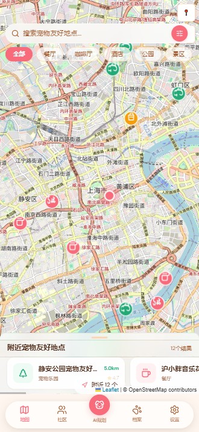
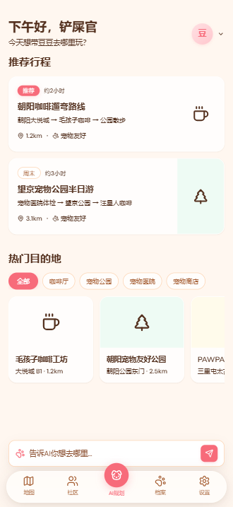
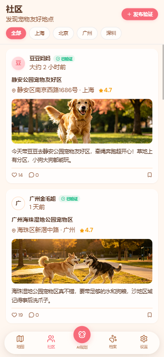
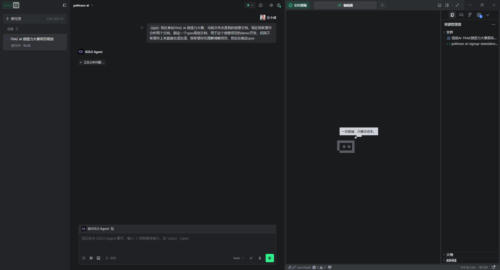
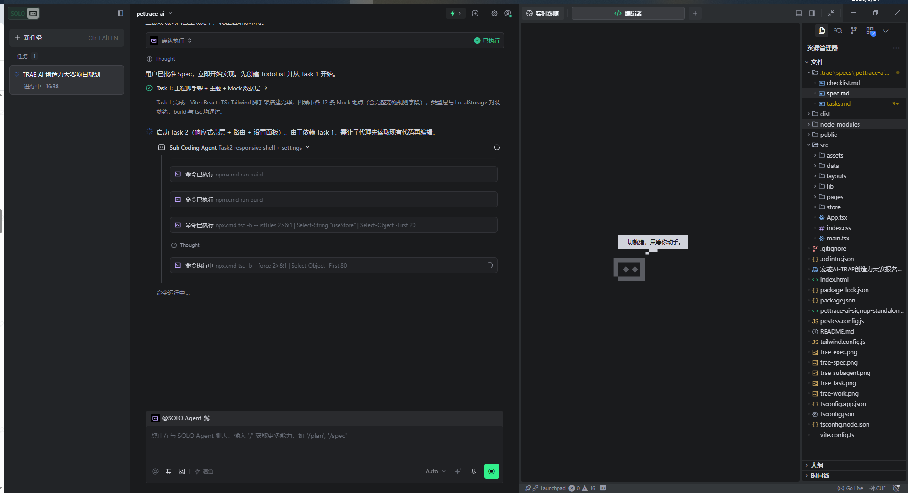
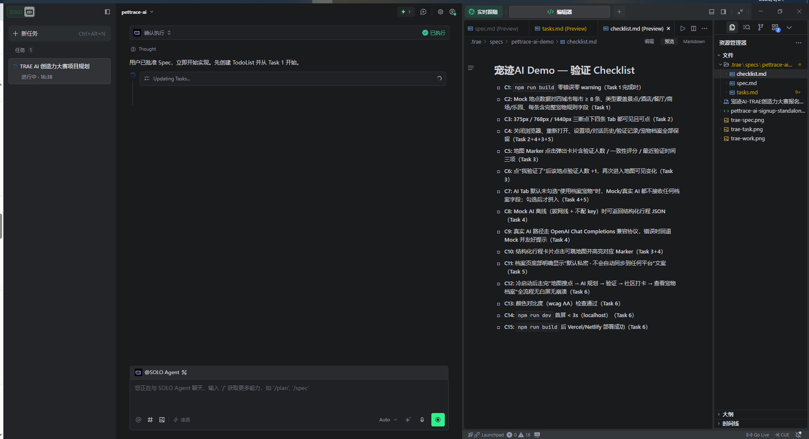
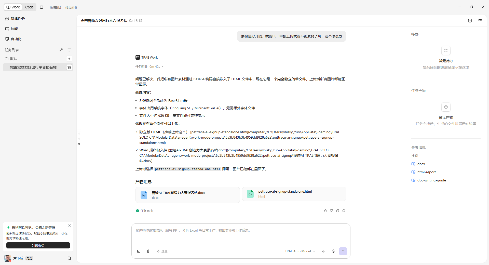
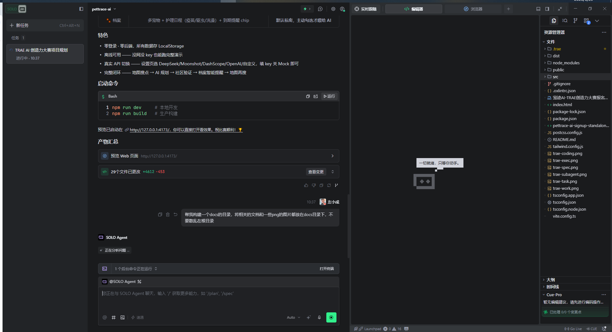

---
tags:
  - 生活娱乐
  - 社会公益
---

# 【生活娱乐赛道】宠迹AI — PetTrace AI

## 0. 先和大家打个招呼吧 👋

**你是谁**：一名独立开发者，热爱宠物，希望用技术为养宠家庭创造更好的出行体验。

**你是怎么用 TRAE 把 Demo 做出来的**：最初只是有个模糊的想法——"想做一个携宠出行的 AI 助手"，但不知道从何下手。我把这个想法告诉 TRAE，它帮我梳理了产品需求、划分了开发任务，从技术选型到代码实现一步步指导。最让我惊喜的是地图模块和 AI 对话的结合，原本以为会很复杂，但 TRAE 帮我快速搞定了 Leaflet 地图与 React 的集成，还有 Mock AI 规则引擎的实现。整个过程就像和一位全能技术搭档一起工作，让我从想法到可运行产品的周期大大缩短。

## 1. Demo 简介

**是什么**：一个响应式 Web App，专为携宠出行设计的 AI 助手。

**面向谁**：养宠家庭、宠物爱好者、宠物行业从业者。

**主要功能**：

### 🗺️ 宠物友好地点地图
- 支持上海、北京、广州、成都四市切换
- 支持搜索、分类筛选、附近地点横向浏览、定位与缩放控制
- 每个地点标注详细宠物规则（体型限制、是否可进室内、牵引要求、费用等）
- 实时验证人数、最近验证时间、一致性评分



### 🤖 AI 对话式行程规划
- 自然语言输入出行需求（如"带金毛去杭州玩一天"）
- AI 输出结构化行程：日期分段、交通建议、推荐地点、风险提示、行前清单
- 点击行程卡片可在地图高亮对应地点
- 默认启用 Mock AI，无需 API Key 也能演示；也可在设置页切换真实 AI Provider



### 📯 真实验证社区
- 打卡、游记、避雷、经验分享四种内容类型
- 支持发布验证、收藏、点赞与评论入口
- 用户验证反馈回写地点数据，形成真实可信度闭环



### 🐾 宠物私密档案
- 记录宠物基本信息（名字、品种、体型、性格、生日、体重）
- 支持新增/编辑宠物，护理日程管理（疫苗、驱虫、洗澡、体检、绝育）
- 默认私密，需用户主动授权才用于 AI 规划


### ⚙️ AI 服务与本地数据设置
- 支持 OpenAI / DeepSeek / Moonshot / 通义千问 / 自定义 Base URL
- 可在 Mock AI 与真实 API 之间切换，未配置 Key 时自动回退 Mock
- 宠物档案、聊天记录、收藏与验证数据均保存在本机 LocalStorage

## 2. Demo 创作思路

**灵感来源**：养宠多年，每次带宠物出门都要做大量功课——查攻略、打电话确认、担惊受怕。希望有一个工具能让携宠出行更安心。

**想解决的问题**：
- 宠物友好地点信息分散、不准确、更新不及时
- 携宠出行规划复杂，需要考虑宠物规则、交通、安全等多方面
- 缺乏真实用户验证机制，容易踩坑

**为什么做这个方向**：宠物经济正在快速发展，但携宠出行的痛点依然突出。地图 + AI + 社区验证的组合，既能解决信息不对称问题，又能通过用户贡献持续提升数据质量，形成正向循环。

## 3. Demo 体验地址

**在线体验链接**：[https://pettrip-ai.github.io/pettrace-ai/](https://pettrip-ai.github.io/pettrace-ai/)

**体验包下载**：[`docs/dist.zip`](./dist.zip)（2026-07-03 最新构建产物，已编译为静态文件，无需安装依赖）

**本地运行方式**：
```bash
# 解压 docs/dist.zip 后，压缩包内包含 pettrace-ai/ 目录
# 在 pettrace-ai/ 的父目录启动静态服务器
npx serve .

# 然后访问
# http://localhost:3000/pettrace-ai/
```

**注意**：地图瓦片使用 CARTO / OpenStreetMap / 高德 / 天地图等多源候选，首次加载建议联网体验；AI 功能默认使用 Mock 规则引擎，无需配置 API Key 即可体验行程规划，也可以在设置页切换真实 Provider。

**项目 README**：[`README.md`](../README.md)（包含完整的项目说明、启动方式、技术栈等）

## 4. TRAE 实践过程

### 开发流程

1. **需求分析与规划**：与 TRAE 讨论产品方向，输出 PRD、实现计划、验证清单
2. **技术选型**：确定 Vite + React + TypeScript + Tailwind + Leaflet 技术栈
3. **核心功能实现**：逐个完成地图、AI、社区、档案四大模块
4. **移动端适配**：针对手机端优化布局和交互
5. **UI 统一治理**：引入毛玻璃效果、萌宠暖色主题、iOS 风格导航
6. **真机体验复盘**：针对安全区、抽屉底部按钮、地图控件、滚动容器等移动端细节做回归修复

### 开发关键步骤截图







### 关键任务对话 Session ID

1. 会话 1：创意理解 + Spec 规划
   Session ID：`.1810261475335466:caf8fb681553a82cd65c92e685992c6e_6a3b81728ce594575223e25a.6a3b97a08ce594575223e25d.6a3b979e2ca67679fed9afb1`

2. 会话 2：工程全栈实现（Task 1–6）
   Session ID：`.1810261475335466:993d0eb17d7a938aa9cafbbcbaca387a_6a3b81728ce594575223e25a.6a3c94778ce594575223e6b3.6a3c94762ca67679fed9afb1`

3. 会话 3：移动端深度适配
   Session ID：`.1810261475335466:1810261475335466_6a3ce6608ce594575223ecd2`

4. 会话 4：UI 统一治理（毛玻璃 + 萌宠风）
   Session ID：`.1810261475335466:1810261475335466_6a3e4db57d00d6336047b679`

5. 会话 5：UI 设计稿对齐
   Session ID：`.1810261475335466:1810261475335466_6a3e4db57d00d6336047b679`

6. 会话 6：项目验收与初赛报名
   Session ID：`.1810261475335466:1810261475335466_6a44c2499d913156253baf3e`

### 技术栈

- **框架**：Vite 8 + React 19 + TypeScript
- **样式**：Tailwind CSS 3.4
- **路由**：React Router DOM 7
- **地图**：Leaflet + react-leaflet 5
- **地图瓦片**：CARTO / OpenStreetMap / 高德 / 天地图候选源
- **图标**：Lucide React
- **状态管理**：Zustand 5
- **AI 兼容**：OpenAI Chat Completions 协议（支持 OpenAI / DeepSeek / Moonshot / 通义千问）

## 5. 对应的报名审核通过的帖子链接

[https://forum.trae.cn/t/topic/43184](https://forum.trae.cn/t/topic/43184)

---

### 补充说明

**数据隐私**：本 Demo 所有数据均存储在浏览器 LocalStorage，无任何云端上传，无需登录，零后端依赖。

**离线可用**：宠物档案、社区数据、设置、收藏与 Mock AI 均可在本地浏览器中运行；地图底图首次加载依赖网络，已有缓存时可继续展示。

**移动端优先设计**：采用底部 TabBar + 抽屉式交互，专为手机端打造，提供流畅的移动端体验。
